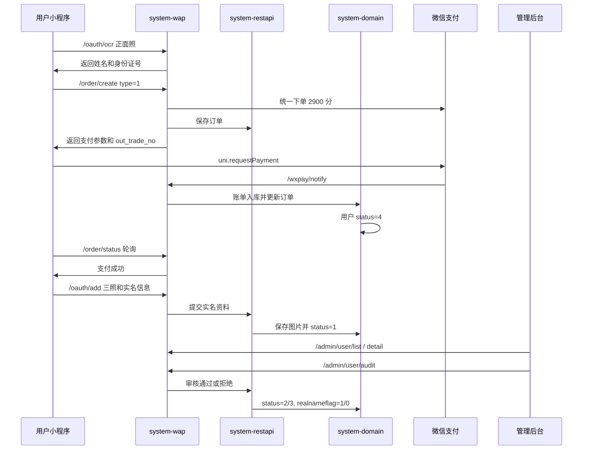

# 实名认证旧版全链路恢复设计

日期：2026-07-10

## 背景

本次要在新版小程序 `frontend` 中恢复旧版 `91pai-master` 的实名认证业务逻辑。旧版流程包含身份证正面、身份证反面、手持身份证三张照片，正面照片 OCR 识别姓名和身份证号，首次提交前收取 29 元审核费，支付成功后进入人工审核。审核失败后用户可重新提交认证资料，不再重复支付。

项目当前仍处于开发初期，无历史用户数据需要迁移或兼容。因此本设计不保留新版“两照免费”分支，直接恢复旧版业务状态机。

## 目标

- 新版小程序 `pages-sub/user/realname` 实现三照上传、OCR 识别、29 元支付、支付后提交、审核状态展示和审核失败重提。
- OCR 继续沿用现有 `/oauth/ocr` 能力，不更换第三方识别服务。
- 支付继续复用现有 `/order/create`、`/order/status` 和微信支付回调链路。
- 后端强制校验实名认证支付和三张照片，不能只依赖前端校验。
- 管理后台继续提供实名列表、实名详情和审核通过/拒绝，详情页能清晰查看三张证件照片。
- 整条链路默认安全：防越权、防低价支付、防重复提交、防绕过支付、防空响应审核失败、防隐私误展示。

## 非目标

- 不重新设计 OCR 服务。
- 不引入新的支付渠道。
- 不接入新的支付订单表重构实名认证订单。
- 不处理历史两照免费认证数据迁移，因为当前无历史用户。
- 不增加自动身份核验或人脸识别。

## 推荐方案

采用“旧版业务逻辑 + 新版技术栈实现”：

- 前端使用新版 Vue 3/uni-app 页面和现有 Keep UI 风格，恢复旧版三照、支付确认弹窗和支付后提交逻辑。
- 后端复用现有订单、账单、OCR、实名提交、后台审核能力，在关键入口补强服务端校验。
- 管理后台沿用现有 `frontend-admin` 实名审核页面，补足三照展示和审核接口健壮性。

不选择完全复刻旧版 UI，是因为旧版 Vue2 页面样式和新版 Keep UI 风格不同；不选择新建统一支付链路，是因为范围会扩大到支付表、回调、对账和后台订单语义重构。

## 状态机

用户实名相关状态沿用现有 `UserStatus`：

- `0` 暂存：未支付、未提交实名资料。
- `4` 支付成功：已支付实名认证审核费，可提交实名资料。
- `1` 待审核：实名资料已提交，等待后台审核。
- `2` 审核通过：实名认证完成，`realnameflag=1`。
- `3` 审核未通过：可重新提交三照和实名信息，不再重复支付。

允许操作：

- `0`：可发起 29 元支付；不可直接提交实名资料。
- `4`：可提交实名资料。
- `1`：只展示审核中，不允许重复提交。
- `2`：只展示已认证，不允许重复提交。
- `3`：可重新提交实名资料，不再支付。

## 前端设计

### 页面入口

保留现有入口：

- `frontend/src/pages-sub/user/realname-intro.vue`
- `frontend/src/pages-sub/user/realname.vue`

介绍页继续进入实名表单页。表单页根据 `/oauth/get` 或 `/oauth/detail` 返回的状态展示不同内容。

### 表单内容

`realname.vue` 恢复三张照片：

- 身份证正面：选择后调用 `/oauth/ocr`，自动回填姓名和身份证号。
- 身份证反面：只上传，不做 OCR。
- 手持身份证：必填，作为旧版人工审核依据。

表单字段：

- 真实姓名：必填，最大长度沿用后端校验。
- 身份证号码：必填，支持 15 位或 18 位，提交前转大写。
- 图片：三张均必填，提交时统一转换为 dataURL 图片数据。

### 支付与提交

首次提交流程：

1. 用户填写资料并选择三张照片。
2. 前端校验通过后展示 29 元审核费确认弹窗。
3. 用户确认后调用 `/order/create`，`type='1'`。
4. 后端返回微信支付参数和 `out_trade_no`。
5. 前端调用 `uni.requestPayment`。
6. 支付成功后轮询 `/order/status?out_trade_no=...`。
7. 服务端确认订单支付成功后调用 `/oauth/add` 提交实名资料。
8. 提交成功后清理本地临时图片和表单，刷新认证状态为待审核。

审核失败重提流程：

1. 状态为 `3` 时展示审核失败提示。
2. 用户重新上传三张照片并提交。
3. 前端不再发起支付，直接调用 `/oauth/add`。
4. 提交成功后状态回到 `1` 待审核。

### 前端安全约束

- 前端不能决定实名认证价格，只展示 29 元。
- 前端不能仅凭 `uni.requestPayment` 成功就提交，必须等待 `/order/status` 服务端确认支付成功。
- 提交前清理空图片、重复点击、无效身份证号。
- 页面卸载时清理本地临时图片和表单数据。
- 已认证状态只展示脱敏姓名和脱敏身份证号，不展示证件照片。

## 后端设计

### `/order/create`

实名认证订单 `type='1'` 必须由后端强制金额。

当前旧版前端曾传 `total_fee: 29`，但现有支付实现已约定 `total_fee` 统一按“分”。因此本次设计要求：

- 实名认证审核费服务端固定为 `2900` 分。
- 当 `type='1'` 时，后端忽略或覆盖客户端传入的 `total_fee`。
- 只允许当前登录用户为自己创建实名认证订单。
- 创建订单返回 `out_trade_no`，用于前端轮询。

### 微信支付回调

继续走现有 `/wxpay/notify` 和 `BillService`：

- 回调验签成功后生成账单。
- 找到对应订单并将订单状态置为已支付。
- 当订单类型为 `REAL` 时，将用户 `status` 更新为 `4` 支付成功。
- 回调保持幂等，重复回调不得重复发放权益或重复改变异常状态。

### `/oauth/ocr`

继续沿用现有 OCR 逻辑：

- 只识别身份证正面。
- 返回姓名和身份证号。
- OCR 失败时前端允许用户手动填写。
- OCR 失败不得保存图片或改变用户认证状态。

### `/oauth/add`

服务端必须补强校验：

- 登录用户只能为自己提交认证。
- 必须提交姓名、身份证号和三张图片。
- 图片必须是支持的 dataURL、裸 Base64 或已支持的存储 URL。
- 图片解码后必须是合法图片类型，并限制大小。
- 当前用户状态必须是 `4` 支付成功或 `3` 审核未通过。
- `realnameflag=1` 时拒绝重复提交。
- 保存图片成功后将用户状态置为 `1` 待审核，并删除旧的非头像证件图片。
- 提交成功后给管理员发送待审核订阅消息；消息推送失败只记录日志，不回滚实名提交。

### 后端安全约束

- 金额以服务端为准，防止客户端低价支付。
- 订单状态查询必须按当前用户过滤，防止用他人 `out_trade_no` 冒充支付成功。
- 实名提交必须检查用户支付状态，防止绕过支付直接调 `/oauth/add`。
- 图片上传失败时不能留下半提交状态。
- 后端日志不得输出完整身份证号或完整 Base64 图片内容。
- 后端返回给普通用户的实名信息应只用于状态展示；前端展示时继续脱敏。

## 管理后台设计

### 列表

沿用 `frontend-admin/src/views/manage/user-list/index.vue`：

- 支持按状态筛选。
- 展示用户 ID、昵称、手机号、实名姓名、证件号码、注册时间、状态。
- 操作入口为实名审核弹窗。

### 详情弹窗

`UserAuditDialog.vue` 补充三照语义展示：

- 第 1 张：身份证正面。
- 第 2 张：身份证反面。
- 第 3 张：手持身份证。
- 图片支持预览和加载失败提示。

### 审核

沿用 `/admin/user/audit`：

- 通过：状态置 `2`，`realnameflag=1`。
- 拒绝：状态置 `3`，用户可重新提交，不再支付。
- 审核结果通过订阅消息通知用户。
- 管理端接口必须兼容下游 `void` 或空响应，不能因为 JSON 解析空响应导致实际审核成功但后台提示失败。

## 数据流

## 错误处理

- OCR 失败：提示“识别失败，请手动填写”，保留用户已选正面照。
- 支付取消：保持表单内容，不提交实名资料。
- 支付成功但服务端未确认：提示稍后刷新，不调用 `/oauth/add`。
- 订单确认超时：保留表单内容，用户可点击重试确认。
- 图片上传失败：提示失败并保持当前表单状态。
- 审核失败：展示失败状态和重提入口，不展示支付入口。
- 后台审核消息推送失败：审核结果仍生效，记录推送日志。

## 验证计划

按用户要求，不下载依赖、不做完整构建，由用户手动测试真机链路。实现完成后只做改动范围内的轻量验证：

- 前端实名页：状态分支、三照必填、OCR 回填、支付参数检查、支付后提交、审核失败重提。
- 前端 API：`/order/create`、`/order/status`、`/oauth/ocr`、`/oauth/add` 参数契约。
- 后端源码测试或静态检查：实名认证金额强制为 2900 分，`/oauth/add` 支付状态和三照校验，后台审核空响应兼容。
- 管理后台：三照展示、审核按钮状态、审核成功后刷新列表。
- Git 检查：只包含本需求相关改动，不修改旧版 `91pai-master` 业务代码。

## 开放问题

无。用户已确认完全沿用旧版逻辑，并确认当前无历史用户需要兼容。
